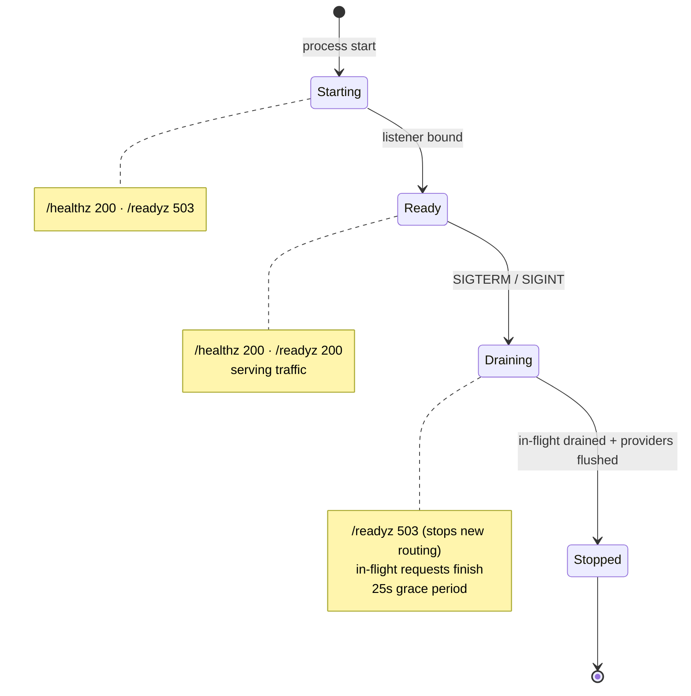

# aegis-greeter

A stateless Go HTTP greeter, packaged and operated like a production
service. It is the application side of a two-repository GitOps system:
this repo holds the service, its tests, the container build, and the
CI/CD that ships images; the sibling repo
[`aegis-stateless`](https://github.com/BinHsu/aegis-stateless) holds the
Terraform, the EKS cluster, ArgoCD, and the Kubernetes manifests.

The service itself is deliberately small. The point of the project is
everything *around* the service — host-isolated tooling, boundary-tested
code, a minimal-surface container, layered quality gates, and a CI
pipeline that builds images and hands off to GitOps without ever
touching the cluster.

## Who is this for

| You want to… | Start here |
|---|---|
| Run it in 30 seconds | [Run it locally](#run-it-locally) |
| Call the API | [HTTP API](#http-api) · [Metrics](#metrics) |
| Understand the design | [Architecture](#architecture) + the [ADRs](docs/adr/README.md) |
| Review the engineering | [Quality gates](#quality-gates) + [CI/CD](#cicd) |
| See what is deferred, and why | [Known limitations](#known-limitations) |
| Lift it as a starting point | [Reusing this as a template](#reusing-this-as-a-template) |

## HTTP API

Three endpoints, all `GET`, all plain-text responses — no request body,
no authentication, no versioning.

| Endpoint | Request | Responses |
|---|---|---|
| `GET /` | `?name=` — optional, max 256 bytes | **`200`** `text/plain` — `Hello, <name>! I'm <hostname> [<tag>]`. `<name>` is the `?name=` value, or the caller IP (`X-Forwarded-For` if present, else `RemoteAddr`) when absent. `<tag>` is the `HELLO_TAG` env value — the brief's "unique tag"; the `[<tag>]` suffix is omitted when `HELLO_TAG` is unset. **`400`** — `name` exceeds 256 bytes. |
| `GET /healthz` | — | **`200`**, empty body — unconditional once the process is up. The Kubernetes liveness target. |
| `GET /readyz` | — | **`200`** while serving, **`503`** before the listener binds and during the shutdown drain. The Kubernetes readiness target — see [Lifecycle](#lifecycle). |

## Lifecycle

`/readyz` is *drain-aware*: it reports 503 both before the listener is
bound and during shutdown, so an orchestrator routes traffic only while
the service can actually serve it.



On `SIGTERM` the order is fixed: flip `/readyz` to 503, drain in-flight
requests via `http.Server.Shutdown`, flush the OpenTelemetry providers,
exit 0. A request still running past the 25-second grace period is
abandoned so shutdown cannot hang. See AG-02.

## Architecture

```
┌─────────────────────────────┐         ┌──────────────────────────────────┐
│ aegis-greeter (this repo)   │         │ aegis-stateless (sibling)        │
│                             │  push   │                                  │
│  cmd/greeter, internal/     │── ECR ─→│  k8s/overlays/prod/              │
│  Dockerfile                 │         │  └── kustomization.yaml          │
│  .github/workflows/         │  commit │      ← image tag bumped by       │
│                             │── PAT ─→│        this repo's CI            │
│                             │ to repo │           ↓                      │
│                             │         │       ArgoCD sync → EKS          │
└─────────────────────────────┘         └──────────────────────────────────┘
```

CI produces exactly two things: a container image in ECR, and a git
commit in the sibling repo that bumps the image tag. ArgoCD inside the
cluster reconciles from there. The application CI never runs `kubectl`.

## Observability

The service emits all four signal types to a Grafana Cloud stack via a
local Grafana Alloy DaemonSet:

| Signal | How | Backend |
|---|---|---|
| Metrics | OpenTelemetry SDK; `otelhttp` middleware auto-emits HTTP RED metrics; two custom instruments (`greeter_responses_total{personalized}`, `greeter_build_info`) | Grafana Cloud Mimir |
| Traces | OpenTelemetry SDK; OTLP gRPC; one span per request | Grafana Cloud Tempo |
| Logs | `log/slog` JSON to stdout, with `trace_id` / `span_id` / `pod` / `node` injected | Grafana Cloud Loki |
| Profiles | `grafana/pyroscope-go` — CPU, alloc, goroutines | Grafana Cloud Pyroscope |

Every exporter is fail-soft: an empty or unreachable endpoint degrades
that subsystem to a no-op and never blocks the request path.

## Metrics

Metrics leave the process over OTLP gRPC (see [Observability](#observability)
for the pipeline). Two custom business instruments, plus the standard
HTTP RED metrics the `otelhttp` middleware emits automatically.

| Metric | Type | Labels | What it tells you |
|---|---|---|---|
| `greeter_responses_total` | Counter | `personalized` = `true` \| `false` | Greetings served, split by whether the caller sent a non-empty `?name=`. `rate()` by the label is the personalized-vs-default request rate. |
| `greeter_build_info` | Gauge | `version`, `commit` | Always `1`; the labels carry the running build's identity — the Prometheus "info" metric convention. |
| `http.server.request.duration` | Histogram | `http.request.method`, `http.response.status_code`, `http.route` | Request latency; feed `histogram_quantile` for p50 / p95 / p99. |
| `http.server.active_requests` | UpDownCounter | (as above) | In-flight request count. |
| `http.server.request.body.size`, `…response.body.size` | Histogram | (as above) | Request / response payload size distribution. |

The two `greeter_*` instruments are hand-written (`internal/metrics`); the
`http.server.*` family is emitted by `otelhttp` on the stable OpenTelemetry
HTTP semantic conventions. In Mimir the dotted names appear underscored —
e.g. `http_server_request_duration_seconds_*`.

## Run it locally

Build and run the binary directly:

```sh
make build                              # static binary → ./bin/greeter
HELLO_TAG=demo ./bin/greeter &          # listens on :8080
curl 'localhost:8080/?name=Operator'    # → Hello, Operator! I'm <hostname> [demo]
curl  localhost:8080/                   # no name → falls back to caller IP
curl  localhost:8080/healthz            # → 200
curl  localhost:8080/readyz             # → 200
kill %1                                 # SIGTERM → graceful drain, exit 0
```

Or run the container — no host Go toolchain needed at all:

```sh
make image
docker run --rm -p 8080:8080 -e HELLO_TAG=local aegis-greeter:latest
```

`LOG_LEVEL=DEBUG` makes the slog output verbose; see [Configuration](#configuration).

## Reviewer setup

The project owns its toolchain. Nothing it installs lands in your
`~/go/bin`, `/usr/local`, or shell profile — the Go compiler is pinned
in `go.mod` and dev tools install into `./bin/`.

```sh
make hooks-install   # activate the git hooks (optional but recommended)
make dev-setup       # install golangci-lint, govulncheck, actionlint, gitleaks into ./bin/
make test            # run the suite with the race detector
```

Your host Go version does not matter: `go.mod` declares a `toolchain`
directive and `GOTOOLCHAIN=auto` (Go's default since 1.21) fetches the
pinned compiler on demand.

## Quality gates

Checks are layered shift-left — the earlier a defect is caught, the
cheaper it is to fix:

| Stage | Trigger | Checks |
|---|---|---|
| `pre-commit` hook | every `git commit` | `gofmt`, `go vet`, `go build` |
| `pre-push` hook | every `git push` | the above + `go test -race`, `golangci-lint`, `govulncheck`, `gitleaks`, `actionlint`, `hadolint` |
| GitHub Actions `ci.yml` | every PR and push | the full pre-push suite + container build + Trivy image scan |
| GitHub Actions `codeql.yml` | push, PR | CodeQL static analysis (see [Known limitations](#known-limitations)) |
| GitHub Actions `dependency-review.yml` | every PR | blocks PRs adding HIGH+ vulnerable dependencies |

Local hooks and CI run the *same* `make` targets, so "passes locally"
genuinely predicts "passes CI". Run the full local gate by hand with
`make prepush`.

## CI/CD

| Workflow | Runs on | Does |
|---|---|---|
| `ci.yml` | PR, push | Verification gate; secrets-free, expected always green. |
| `codeql.yml` | push, PR | SAST. Code scanning needs a public repo or GitHub Advanced Security, so the job skips cleanly while the repo is private and activates when it goes public. |
| `dependency-review.yml` | PR | Dependency-diff vulnerability gate. |
| `publish.yml` | push to `main` | Build → push to ECR over OIDC → commit the image tag back to the sibling repo. |

`publish.yml` authenticates to AWS with GitHub OIDC — no static keys —
and writes back to the infra repo with a fine-grained, short-lived PAT.
Every third-party action is pinned to a commit SHA.

## Configuration

All configuration is environment variables; there is no config file.

| Variable | Default | Purpose |
|---|---|---|
| `LISTEN_ADDR` | `:8080` | Listen address. |
| `LOG_LEVEL` | `INFO` | `DEBUG` / `INFO` / `WARN` / `ERROR`. |
| `HELLO_TAG` | — | Unique tag echoed in the `GET /` greeting and logged at startup; the infra side sets it per region. |
| `OTEL_SERVICE_NAME` | `aegis-greeter` | OpenTelemetry service name. |
| `OTEL_EXPORTER_OTLP_ENDPOINT` | — | OTLP gRPC endpoint; empty disables trace/metric export. |
| `PYROSCOPE_ENDPOINT` | — | Pyroscope endpoint; empty disables profiling. |
| `POD_NAME`, `NODE_NAME` | — | Downward API values; surfaced as `pod` / `node` log fields. |

## Known limitations

Honest accounting of what is deferred and why — none of these is a code
defect; each is a constraint of the current environment.

- **Branch protection is not enforced.** GitHub rulesets require a
  public repository or a paid plan; on a private repo on the Free plan
  the API returns 403. The intended ruleset (require the `verify` CI
  check, linear history, block force-push) activates when the repo is
  made public. Until then the CI gate is advisory, not blocking.
- **CodeQL does not run while the repo is private.** Code scanning has
  the same public-or-paid constraint. `codeql.yml` is committed and
  gated on repository visibility — it skips cleanly now and activates
  on the first push after the repo goes public.
- **A stale `latest` image tag exists in ECR.** An early publish run
  pushed `latest` before the tag strategy settled on SHA-only
  (AG-03). The ECR repository is immutable, so that tag is frozen
  at an old digest. It is harmless — ArgoCD deploys the SHA tag — and
  is left for infra-side cleanup.

## Reusing this as a template

The greeter logic is trivial and not the point. What is reusable is the
scaffolding around it:

- the project-local Go toolchain — `tools.go` + `Makefile` + `GOBIN`
  (AG-01);
- the multi-stage, digest-pinned, distroless `Dockerfile` (AG-03);
- the layered quality gates — git hooks plus the GitHub Actions
  workflows in `.github/workflows/`;
- the `cmd/` + `internal/` layout (AG-01);
- the OpenTelemetry + Pyroscope wiring in `internal/telemetry`.

To adapt it: change the module path in `go.mod` (and the matching
import paths), replace the handler in `internal/handlers`, and re-point
the ECR / cross-repo values used by `publish.yml`. The toolchain, the
Dockerfile, the CI, and the layout carry over unchanged.

## Decisions

Architecture decision records live in [`docs/adr/`](docs/adr/README.md) — four
thematic records (toolchain & layout, HTTP service design, container &
delivery, observability). Each states the context, the decisions, the
consequences, the alternatives considered, and what is out of scope
with the trigger to revisit it.

## License

See [LICENSE](LICENSE).
